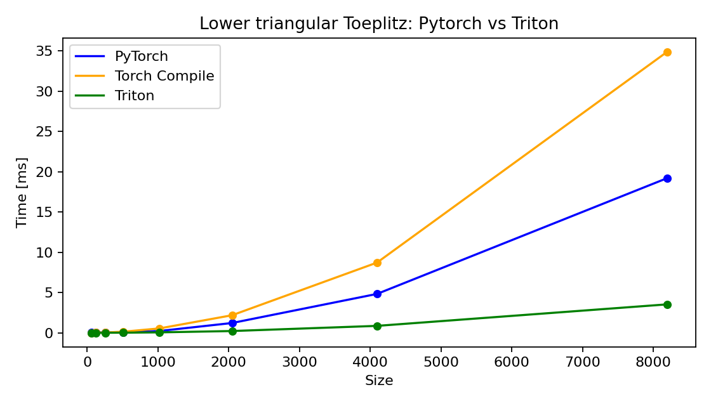

## Efficient Toeplitz Kernel (PyTorch + Triton)

An efficient lower-triangular Toeplitz constructor implemented with a Triton kernel and exposed via PyTorch. Includes a pure PyTorch reference and an example with `torch.compile`.

### Install with uv

```bash
# from repo root
uv venv
. .venv/bin/activate
uv pip install -e .
```

Requires a working CUDA + PyTorch + Triton setup.

### Quick start

```python
import torch
from efficient_toeplitz_kernel import (
    toeplitz_triton,
    reference_toeplitz,
    reference_toeplitz_compiled,
)

device = "cuda"
m = 8
vals = torch.arange(1, m + 1, device=device, dtype=torch.float32)

# Triton implementation
T = toeplitz_triton(vals)
print(T)

# Reference (PyTorch) and compiled variant
T_ref = reference_toeplitz(vals)
T_comp = reference_toeplitz_compiled(vals)

torch.testing.assert_close(T, T_ref)
print("Triton and reference match!")
```

### Benchmark

The plot below shows the comparison between PyTorch eager, `torch.compile`, and Triton. To reproduce, you can run:

```bash
python scripts/bench_plot.py
```




